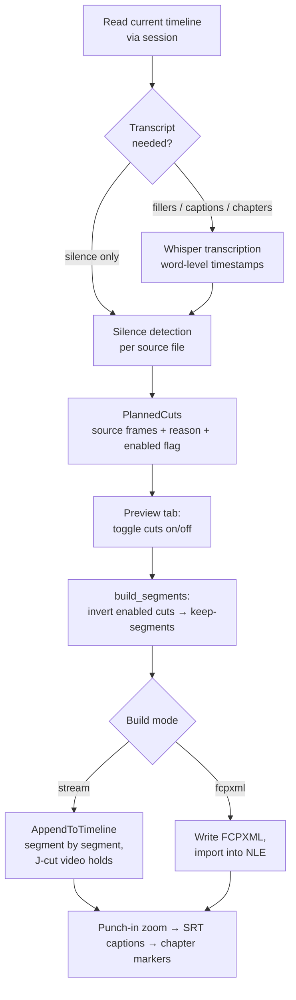

# How It Works

The pipeline has two phases that are usable separately (Analyze → preview →
Build in the GUI) or fused (`run_autocut()`, the "Run AutoCut" button).
Phase 1 touches nothing; only Phase 2 writes to Resolve — and even then it
builds a *new* timeline, never modifying the original.



## Phase 1 — Analyze (`analyze_autocut`)

1. **Read the timeline.** Clips on the configured video track are snapshotted
   with their source file paths, in/out points, and durations.
2. **Transcribe if needed.** Whisper runs only when fillers, captions, or
   chapters are enabled — plain silence removal never loads a model. Each
   source *file* is transcribed once and shared by every clip that uses it.
3. **Detect silences.** Each clip's source audio is decoded (librosa, with a
   PyAV fallback for MP4/AAC when no ffmpeg CLI is installed) and RMS energy
   is measured in ~10 ms hops. Regions below the threshold and longer than
   `min_silence_sec` become cut candidates, shrunk by `padding_frames` on
   each side.
4. **Find fillers.** With filler removal on, transcript words matching the
   filler list (punctuation stripped, lowercased) become cuts too.

The result is an `Analysis`: a list of `PlannedCut`s in **source frames**,
each carrying a human-readable reason and an `enabled` flag. The Preview tab
is just a view over these flags — unticking a row flips `enabled`, nothing
else.

### The adaptive threshold

A fixed threshold like −42 dB assumes studio silence. Camera auto-gain keeps
"silence" hot — often around −22 dB on real footage — so a fixed threshold
finds literally nothing. The auto threshold instead measures each file:

- noise floor = 5th percentile of the RMS curve
- speech level = 75th percentile
- threshold = floor + 35 % of the spread (or floor + 3 dB if the file is too
  flat to separate)

This is why `auto_threshold` is the default and the manual dB value is the
fallback, not the other way around.

## Between the phases — `build_segments`

Enabled cuts are merged (overlapping silence and filler ranges collapse) and
inverted into **keep-segments**: the parts of each clip that survive. Each
segment gets its position in the new timeline (`timeline_offset`) and how
much source time was removed before it (`gap_before_sec` — later used for
chapter detection). A clip that is *entirely* silence is kept whole rather
than silently dropped.

## Phase 2 — Build (`apply_autocut`)

### Stream mode (default)

Segments are appended to a freshly created timeline via Resolve's
`AppendToTimeline`, in batches, so cuts appear live as they land.

With `jcut_frames = 0` this is a plain compact cut. With a J-cut lead, video
and audio are appended in **two separate passes** using `mediaType`
(1 = video-only, 2 = audio-only) and `recordFrame` (explicit position):

- The **audio** track is the plain compact cut. The voice is never moved or
  padded — padding audio with the removed silence would just delay the voice.
- At each cut, the previous segment's **video** holds `hold` frames over the
  start of the next line. Its tail extends into its own removed silence (the
  speaker pausing on camera), and the next segment's video head is trimmed by
  the same amount, keeping everything in sync.

The hold at each cut is:

```
hold = min(jcut_frames,
           silence gap between the segments,   # video to hold on must exist
           next segment length − 1)            # never consume a whole segment
```

and only between segments of the **same source clip** — across clip
boundaries there is no removed silence to hold on, so `hold = 0`.

### FCPXML mode

The same segment list is written as an FCPXML file — `<gap>` spine, video
clips on lane 1, audio on lane −1, identical J-cut lead math — and imported.

!!! warning "FCPXML mode is for Premiere / Final Cut interchange"
    The free Mac App Store build of Resolve imports FCPXML with permanently
    **offline** media: imported items have no media-pool item at all, so no
    relink can fix them. The file itself is valid — Premiere and FCP import
    it fine. For Resolve, use stream mode (the default); J-cuts work there
    too.

## Post steps (all optional)

**Punch-in zoom** — every second clip on the new timeline gets
`ZoomX`/`ZoomY` set to `zoom_amount`, the classic alternating punch-in that
hides jump cuts.

**Captions** — transcript words are mapped *through the kept segments* onto
new-timeline time, so captions match the cut edit, not the original footage.
Lines flush at every segment boundary (a caption never straddles a cut) and
break on pause > 0.7 s, ~38 characters, or 4 s duration. For Thai — which has
no spaces and comes out of Whisper as sub-word fragments — breaks are gated
so a line never starts with a dependent vowel/tone mark and never ends on a
leading vowel; breaking at arbitrary fragment edges would split syllables.
The SRT is placed on a subtitle track when the build allows it; otherwise it
lands in the media pool and one drag finishes the job.

**Chapter markers** — any segment preceded by at least `chapter_gap_sec` of
removed source time gets a purple marker, titled with the first few
transcribed words spoken there.
